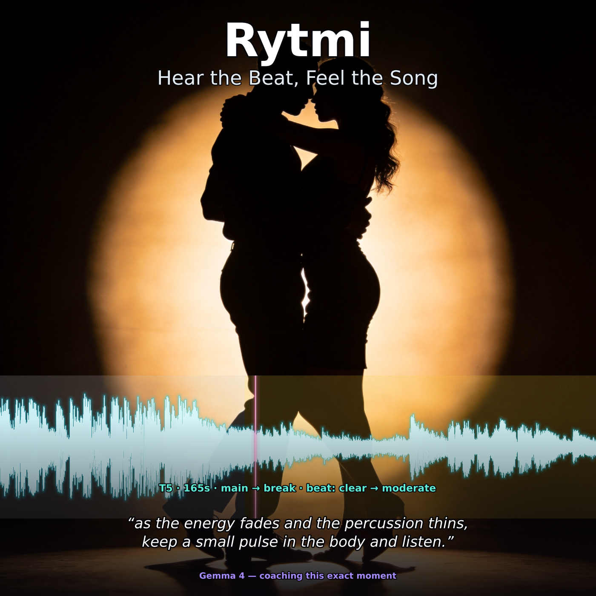

# Rytmi — DSP + Gemma 4 rhythm-learning prototype

> **Submitted track:** _Future of Education_ (rhythm/music learning).
> Also eligible for _Ollama Special Technology_ (local-first deployment).



## The problem

Many dancers struggle to *hear* the beat in some music. Bachata's "1" is acoustically clear — bass and percussion grid spell it out. Kizomba's pulse is genuinely subtle: heavy percussion frequently lands on syncopated off-beats inherited from Antillean Zouk, which is exactly what a generic transient-based beat tracker latches onto, mislabelling the loud syncopation as "1". Generic counting apps don't know the difference; a naive tracker can confidently mislead a learner on exactly the sections where the pulse matters most.

Rytmi treats this as a teachable moment. A style-aware DSP layer reports what the audio actually contains — including how *clear* the pulse is per section. Then **Gemma 4 helps the dancer hear and connect with what the music is doing**: it turns the grounded analysis into language a learner can use — what is happening in this section right now, what kind of feeling it has, and what that means for how to move. Beginners need help finding the pulse at all; intermediates lose it during subtle sections, breaks, and stylistic shifts. Both are served by the same idea: a coach that explains the music as it actually is, distinguishes "trust the pulse here" from "the pulse is hard to lock onto here, here is what to do", and never invents a confident answer the music doesn't support.

## Architecture

`audio → DSP (librosa + Demucs) → RhythmAnalysis → Gemma 4 prompt → coaching, with a verifier that re-grounds Gemma's output in the DSP result.`

The split is deliberate: DSP handles what the audio physically contains; Gemma handles language. Gemma is never the primary beat detector and is forbidden from inventing musical facts. A small core: `src/rytmi/dsp.py` (beat tracking, HPSS, section labelling, downbeat detection, a kizomba-specific batida tracker), `src/rytmi/prompts.py` (style-aware prompt registry + deterministic verifiers + `format_unified_timeline`), `src/rytmi/llm.py` (Ollama or any OpenAI-compatible Gemma 4 backend).

## How Gemma 4 is used

Gemma 4 turns the structured DSP analysis into language a learner can use. Five design choices keep it grounded:

- **Style-aware prompt registry.** Each prompt is filled exclusively from the analysis dataclass — no inferred audio facts. Per-style prompts (`KIZOMBA_TUTOR/_DRILLS/_TRANSITIONS`, `BACHATA_*`) carry genre-specific guards; generic prompts (`RHYTHM_ANATOMY`, `LISTENING_GUIDE`, `SONG_ARC`) are templated by `{style}`.
- **Honest about uncertainty.** The kizomba tutor forbids naming a downbeat (detection is unreliable on this style). For `beat: subtle` sections it requires recovery actions instead of confident step prescriptions. The bachata tutor anchors on "1" only when `downbeat_confidence` supports it.
- **Deterministic structure checks.** Gemma writes the coaching text; code validates output shape. The drills verifier checks every P# range against the DSP phase list so a generated practice plan cannot duplicate a phase or cross a `main → outro` boundary.
- **Optional polish pass.** A second Gemma call against a stricter rubric tightens coaching language while preserving every P# header, time span, and beat tag from the draft.
- **Local-first.** Default backend is Gemma 4 served via Ollama; the same `generate()` interface works against any OpenAI-compatible cloud endpoint.

We explored having Gemma do more — feeding raw song audio to the audio-capable Gemma 4 variants (E2B/E4B) and asking for beat cues and instrument identification. Results were unreliable: inconsistent instrumentation, missed percussion entries, no trustworthy beat anchor on subtle-pulse cases. Gemma is excellent at *talking about* music given a structured description; DSP earns its keep by being the part that listens.

**Per-track demo flow** (seven Gemma modes, each grounded in the same `RhythmAnalysis`): `rhythm_anatomy` → `listening_guide` → `song_arc` → `kizomba_tutor`/`bachata_tutor` → polished tutor → `kizomba_transitions`/`bachata_transitions` → `kizomba_drills`/`bachata_drills`. The polished tutor + transitions compose via `format_unified_timeline(...)` into a single chronological narrative `P1, T1, P2, T2, … P_n` — the demo's primary surface and the signature pattern: *code identifies the structure, Gemma writes the language, code verifies the result covers the song without inventing it.*

## A worked example

Kizomba track at 92 BPM with a severe break around 148s:

```
[song arc] The track begins low-energy... after a low-energy break at 148s
the energy surges one last time before resolving into a low-energy outro
at 195s. Distinguished by a drum-light feel where melody carries rhythm.

[kizomba_tutor — abridged]
P6: 148s-159s, break [beat: clear] — Reduce travel and reset your connection.
P7: 159s-195s, main ×3 [beat: clear] — Add subtle styling now that the pulse feels automatic.

[kizomba_drills]
P6: break (148s-159s) — reduce travel, keep a small pulse in the body. 11s.
P7: main (159s-195s) — same walk-step as P2-P5, now add subtle hip styling. 36s.
```

One live run showed why the verifier matters: Gemma generated good drill prose but crossed a `main → outro` boundary. A 17-track rerun on our kizomba eval set: 0/17 duplicated phases, but 14/17 needed at least one structural repair — almost always because Gemma collapsed many same-label `main` segments into long P#-P# ranges that under-covered the song. The verifier expanded those into phase-correct lines without rewriting Gemma's coaching language.

## Challenges

**Kizomba downbeats are acoustically subtle, not absent.** On every kizomba track in our eval set, `downbeat_confidence < 0.25`. We treated downbeat *detection* as out of scope and pivoted to per-section beat-clarity scoring, so the tutor can say "trust the pulse here" honestly, without ever naming a "1".

**The mel-filterbank gotcha.** The kizomba batida tracker low-passes to 150 Hz then runs `librosa.onset.onset_strength`. This silently produced an all-zero envelope for weeks — the default mel filterbank has no bins below ~80 Hz. Fix: explicit `fmin=20.0, n_mels=8`. Pooled tap-reference F-score on 19 takes: 0.587 → 0.678. When a library silently returns zeros, suspect filterbank assumptions before the input.

## Lessons learned about Gemma 4

- **Helper rationale text becomes echoed vocabulary.** Three iterations of the kizomba downbeat guard pinned this down: keeping the word `downbeat` *only* inside the forbidden-token enumeration (never in declarative explanation) reduced "downbeat" mentions in learner output from 3/7 tracks to 1/7. Same pattern with decimals: listing `'percussiveness of 0.22'` as a forbidden example made the model quote `0.22` on unrelated tracks. Keep negative examples abstract (`<number>`); put the positive replacement next to the forbidden form.
- **Negative examples can backfire.** Literal _"Don't write P7-P8: main"_ made the model emit `P7-P8: main` more often. Abstract notation (`Pn-Pm`) plus a positive worked example reduced incidence. _"Don't say X"_ is weaker than _"say Y"_ for non-deterministic generation.
- **The model is more robust to new vocabulary than expected — *if* surrounding structure is consistent.** When DSP started carving `instrumental` sub-sections out of vocal-quiet runs, no prompt's allow-list mentioned `instrumental`. Gemma 4 wove it in naturally (_"builds through an instrumental phase toward a high-energy peak"_) with zero prompt updates.
- **Code beats prompt prose for structural invariants.** Five prompt iterations couldn't keep the drills plan from crossing `main → outro` under non-determinism. A deterministic post-generation verifier (parses P# format, validates against `analysis.phases`, repairs cross-boundary ranges, fills missing phases) made the whole class of bug go away. Prompt prose alone would never have closed that 14/17 gap.

**Gemma 4 audio for music understanding — tested, shelved.** We explored three angles. Free-form musicality prompts on 12-second clips produced kizomba-shaped prose that didn't differentiate a break from a steady main section — in one controlled test, the excerpt with the most obvious rhythmic break was described as having a "smooth inviting flow", which is the opposite of what was happening. Using Gemma as a vocal-activity source drifted ~8 counts versus Demucs on the eval set, so Demucs stayed the default and the Gemma path became opt-in only. Language detection on transcribed vocals worked 6/7 — useful as a side signal, not load-bearing. The one Gemma audio task that paid off was the simplest: a YES/NO "speech or singing?" on 5-second windows, which gave us the `spoken_intro` section label and fixed real coaching failures on dialog-intro tracks. **Pattern: when the audio task is structurally close to what a speech model was trained on, it works; when you ask for music structure, it produces plausible-sounding text regardless of what the audio actually contains — which is exactly why DSP grounds everything.**

The smaller multimodal E4B also truncated mid-output on the heaviest prompts for tracks longer than ~3.5 minutes, so 26B is the documented baseline for the demo.

## What this demonstrates and where it goes next

The prototype shows the core idea working: a DSP layer that earns its keep, a Gemma 4 layer that helps the learner hear what the music is doing, a per-section honesty signal that prevents the most common LLM failure in this domain, and an end-to-end demo that walks a learner from "what is happening in this song" to "here is your practice plan". It runs on a laptop with Ollama; the same interface works against any OpenAI-compatible cloud endpoint.

Generalisable lesson: **style-specific prompts are warranted only when the genre has an idiosyncrasy worth guarding against** — kizomba's de-emphasised downbeat, tango's tempo elasticity, reggaeton's dembow. For most styles, templated generic prompts plus a good `RhythmAnalysis` are enough.

Next steps (also on the demo close-slide): sharper beat & downbeat grid (meter votes + surfaced confidence), real-music tap-based eval, per-boundary approach-window DSP, learner-level drills (beginner vs improver) with a local-first E4B fallback.

## Links to assets

- **GitHub repo:** <https://github.com/mukatee/rytmi-pub>
- **Kaggle Notebook (live demo):** <https://www.kaggle.com/code/donkeys/gemma-dancing>
- **Demo video (3 min, YouTube):** <https://youtu.be/ISkf6fZbG-Y>
- **Demo notebook:** [`notebooks/00_demo.ipynb`](https://github.com/mukatee/rytmi-pub/blob/master/notebooks/00_demo.ipynb)
- **Gemma model card:** <https://ai.google.dev/gemma> · Kaggle Models: <https://www.kaggle.com/models/google/gemma> · Ollama tags: <https://ollama.com/library/gemma3>
- **Architecture, evaluation, phase notes:** [how-it-works.md](how-it-works.md), [project-vision.md](project-vision.md), [experiments/](experiments/)

## A note on the demo video's audio

The 3-minute demo video uses short excerpts (~14 s each) of three commercial recordings — Filomena Maricoa _Teu Toque_, Charbel _E Magia_, Prince Royce _Corazón Sin Cara_ — solely to demonstrate rhythm analysis and coaching on real material learners want to dance to. A CC-licensed alternative was explored but did not contain comparable instances of the failure modes shown (subtle kizomba pulse, severe break, distinctive vocal entry). If YouTube's ContentID flags the upload, the excerpts will be substituted or removed on request.
